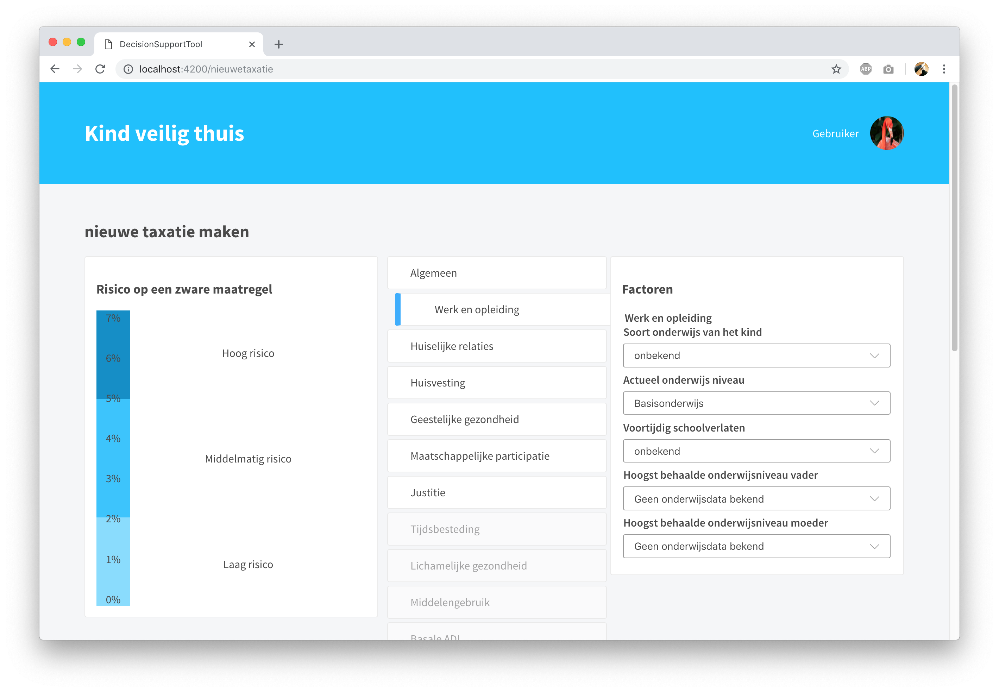

# decision-support-tool

This **decision-support-tool** is a tool for social workers in Amsterdam who support families with complex problems. The tool helps the social workers with making an indication about the chance that a child has to be separated from the parents.

This application is built during a two week [frontend application course](https://github.com/cmda-tt/course-18-19/tree/master/frontend-applications) in association with [Garage2020](https://github.com/cmda-tt/course-18-19/tree/master/frontend-applications). During this course, the focus was on improving the concept of the already existing application made by Garage2020 and building a new prototype using a framework. This application is built with a framework called Ember. [Ember.js](https://www.emberjs.com/) is an open-source JavaScript web framework.

**Good to know: :warning:** This app is still in progress, so some things may not work like you would expect them to work.

## Functionalities

- [x] Data can be read and changed
- [x] Changes to data are reflected in the interface

**To do:**

- [ ] Changes persist across page reloads
- [ ] Values are based on the real algorithm
- [ ] Risc-taxation can be saved and printed
- [ ] ...

Functionalities are based on the [rubric](https://github.com/cmda-tt/course-18-19/blob/master/frontend-applications/assessment.md) of the frontend course.

## Prerequisites

You will need the following things properly installed on your computer.

- [Git](https://git-scm.com/)
- [Node.js](https://nodejs.org/) (with npm)
- [Ember CLI](https://ember-cli.com/)
- [Google Chrome](https://google.com/chrome/)

## Installation

- `git clone https://github.com/sterrevangeest/decision-support-tool.git` this repository
- `cd decision-support-tool`
- `npm install`

## Running / Development

- `ember serve`
- Visit the app at [http://localhost:4200](http://localhost:4200).

### Code Generators

Make use of the many generators for code, try `ember help generate` for more details

## My process during the course

Before this course I have never worked with a big framework like Ember. So, when choosing a framework, I looked for a framework that was doable to learn and had good documentation.

Ember creates a lot of files and directories when you create a new application. In the beginning, I felt a little overwhelmed by all those files. But by following the tutorial and by building the application I found what all the different files and directories did.

In think that Ember is great for starting a small and simple application and slightly growing to a more complex application.

While using Ember I learnt the basics of this framework. I used components and templates, etc. I think that Ember has a lot of functionalities that I have not discovered yet. These functionalities can make building an application easier.

**Pro’s & Cons of Ember**

:smiley: Good documentation on Ember.js
:smiley: Nice tutorial from Ember for learning and understanding the basics of this framework.
:smiley: You can start coding quickly

:disappointed: A lot of files and directory’s can make you feel lost sometimes
:disappointed: Writing tests takes a lot of time and effort.
:disappointed: When you don’t write a test you can get a lot of errors while starting the server
